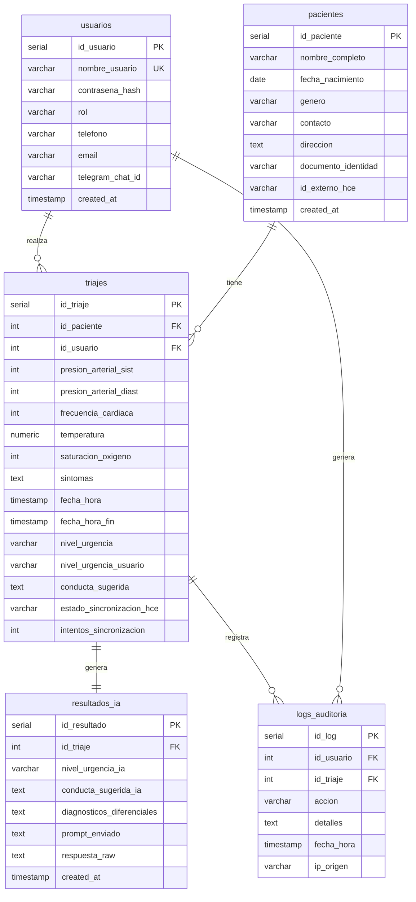
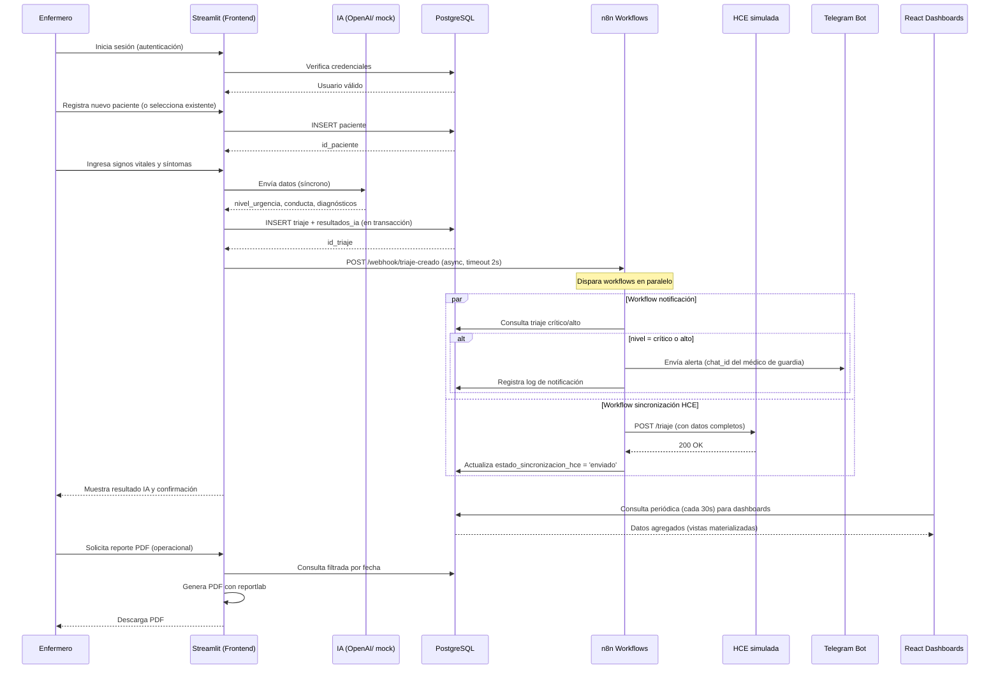
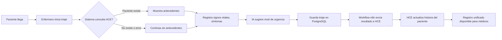

## Análisis y correcciones del Sistema de Triaje Clínico Asistido por IA

A continuación, se presenta el análisis detallado de la lógica de negocio, ambigüedades y propuestas de corrección, junto con los artefactos solicitados.

---

### 1. Modelo de datos (completar y corregir)

#### Campos faltantes y mejoras al esquema SQL

| Tabla | Campo faltante | Tipo | Justificación |
|-------|----------------|------|----------------|
| `pacientes` | `id_externo_hce` | VARCHAR(100) | Identificador único del paciente en el sistema HCE externo, necesario para sincronización. |
| `pacientes` | `documento_identidad` | VARCHAR(50) | Campo para buscar/coincidir pacientes con HCE (ej. cédula, pasaporte). |
| `usuarios` | `telegram_chat_id` | VARCHAR(50) | Para enviar alertas por Telegram a usuarios específicos. |
| `usuarios` | `email` | VARCHAR(100) | Necesario para notificaciones por correo. |
| `triajes` | `fecha_hora_fin` | TIMESTAMP | Para calcular tiempo de atención (desde inicio del triaje hasta finalización/registro). |
| `triajes` | `estado_sincronizacion_hce` | VARCHAR(20) | Valores: `pendiente`, `enviado`, `error`. Control de reintentos. |
| `triajes` | `intentos_sincronizacion` | INTEGER DEFAULT 0 | Número de reintentos de envío a HCE. |
| `triajes` | `nivel_urgencia_usuario` | VARCHAR(20) | Permite que el usuario sobreescriba el nivel sugerido por IA, conservando el original. |
| `resultados_ia` | `prompt_enviado` | TEXT | Auditoría: guardar el prompt exacto enviado al modelo. |
| `resultados_ia` | `respuesta_raw` | TEXT | Auditoría: respuesta cruda de la IA (útil para depuración). |
| `logs_auditoria` | `id_triaje` | INTEGER FK | Vincular log directamente a un triaje cuando aplique. |

#### Restricciones de integridad adicionales

```sql
-- Un triaje debe tener siempre un resultado_ia (relación 1:1)
ALTER TABLE resultados_ia ADD CONSTRAINT fk_triaje UNIQUE (id_triaje);

-- El nivel de urgencia final se toma de triajes.nivel_urgencia (que puede venir de IA o del usuario)
-- Para evitar nulidad, definir valor por defecto 'pendiente' mientras se obtiene IA.

-- Validar que los niveles de urgencia sean valores permitidos
ALTER TABLE triajes ADD CONSTRAINT chk_nivel_urgencia CHECK (nivel_urgencia IN ('bajo', 'moderado', 'alto', 'crítico', 'pendiente'));
```

#### Diagrama MER (Mermaid) completo



#### Vistas materializadas o consultas frecuentes

```sql
-- Vista para métricas diarias (usada en dashboards)
CREATE MATERIALIZED VIEW vista_metricas_diarias AS
SELECT 
    DATE(fecha_hora) AS dia,
    COUNT(*) AS total_triajes,
    COUNT(CASE WHEN nivel_urgencia = 'crítico' THEN 1 END) AS criticos,
    COUNT(CASE WHEN nivel_urgencia = 'alto' THEN 1 END) AS altos,
    AVG(EXTRACT(EPOCH FROM (fecha_hora_fin - fecha_hora))/60) AS tiempo_promedio_atencion_min
FROM triajes
WHERE fecha_hora_fin IS NOT NULL
GROUP BY dia;

-- Actualización periódica (ej. cada hora)
REFRESH MATERIALIZED VIEW CONCURRENTLY vista_metricas_diarias;
```

---

### 2. Definición de usuarios y perfiles

#### Roles y sus atributos

| Rol | Interfaz principal | Acciones permitidas | Tablas con permiso (lectura/escritura) |
|-----|--------------------|---------------------|------------------------------------------|
| **Enfermero de triaje** | Streamlit | - Registrar paciente<br>- Realizar triaje (capturar signos, síntomas)<br>- Ver resultado IA<br>- Guardar triaje<br>- Ver dashboard operacional (solo hoy) | pacientes (R/W), triajes (R/W), resultados_ia (R), logs_auditoria (R solo propios) |
| **Médico** | Streamlit + React | - Todo lo del enfermero<br>- Ver dashboards operacional y de gestión<br>- Anular/corregir nivel de urgencia (sobreescribir)<br>- Generar reportes PDF<br>- Recibir alertas por Telegram | mismos + puede actualizar nivel_urgencia_usuario |
| **Gestor de calidad** | React (preferido) | - Dashboards de gestión avanzados<br>- Métricas de tendencias, tiempos, cumplimiento<br>- Exportar reportes PDF de gestión<br>- Auditar logs | triajes (R), resultados_ia (R), logs_auditoria (R), vista_metricas (R) |
| **Administrador del sistema** | React + CLI | - Gestionar usuarios (CRUD)<br>- Configurar workflows n8n<br>- Monitorear integraciones (HCE, Telegram)<br>- Ver logs completos<br>- Reintentar envíos fallidos | todas las tablas (R/W), además de acceso a configuración de n8n |

#### Justificación del uso de dos frontends

- **Streamlit**: Se utiliza para el **formulario de triaje** y **dashboard operacional rápido** porque permite prototipado ágil, integración directa con Python (IA, BD) y es suficiente para el personal clínico que necesita simplicidad y velocidad de desarrollo. No requiere build ni configuración compleja.

- **React**: Se utiliza para los **dashboards de gestión** y el **módulo administrativo** porque:
  - Ofrece mayor interactividad y rendimiento con grandes volúmenes de datos.
  - Permite componentes reutilizables y gráficos más avanzados.
  - Es la interfaz ideal para gestores y administradores que necesitan filtros complejos, actualizaciones en tiempo real y una experiencia más profesional.

**No hay duplicación funcional**: Streamlit maneja la operación clínica diaria (triaje, reportes PDF bajo demanda), mientras React se enfoca en analítica y administración.

---

### 3. Integración con HCE (Historias Clínicas Electrónicas)

#### Datos mínimos consultados desde HCE externa

- Demográficos: nombre completo, fecha de nacimiento, género, documento de identidad.
- Alergias conocidas (texto).
- Diagnósticos previos (lista de códigos CIE-10 o texto).
- Medicación actual (principio activo, dosis).
- Antecedentes relevantes (quirúrgicos, patológicos, familiares).

#### Formato de la API REST simulada (y real)

| Endpoint | Método | Request | Response | Uso |
|----------|--------|---------|----------|-----|
| `/hce/pacientes/buscar` | GET | `?documento=12345678` o `?nombre=...&fecha_nac=...` | `{ id_externo, nombre, fecha_nac, genero, contacto }` | Coincidencia de paciente |
| `/hce/pacientes/{id_externo}/antecedentes` | GET | - | `{ alergias: [], diagnosticos: [], medicamentos: [], antecedentes: [] }` | Obtener historia clínica resumida |
| `/hce/triaje` | POST | `{ id_externo_paciente, id_triaje_local, fecha, signos_vitales, sintomas, nivel_urgencia, conducta, diagnostico_ia }` | `{ status: "ok", id_registro_hce }` | Enviar resultado del triaje |

#### Mecanismo de coincidencia de pacientes

1. **Prioridad por documento de identidad** (campo `documento_identidad` en tabla `pacientes`). Si existe, se busca directamente en HCE por ese número.
2. Si no hay documento, se usa **nombre completo + fecha de nacimiento** (con tolerancia a errores tipográficos mediante soundex o similar).
3. Si se encuentra coincidencia, se almacena `id_externo_hce` en la tabla `pacientes` local.
4. Si no se encuentra, se crea el paciente solo en el sistema local y se marca para sincronización posterior (el workflow de n8n puede intentar crearlo en HCE).

#### Flujo ante indisponibilidad de HCE

- El sistema local **no depende** de HCE para funcionar; la consulta de antecedentes es opcional (se muestra si está disponible).
- Al enviar un triaje a HCE, si falla, se registra `estado_sincronizacion_hce = 'error'` y `intentos_sincronizacion++`.
- Un workflow de n8n (programado cada 15 minutos) reintenta los envíos fallidos con **backoff exponencial** (máximo 5 intentos). Si persiste el error, se envía alerta al administrador.

#### Responsabilidad de n8n en cada paso

| Paso | Responsabilidad |
|------|----------------|
| Recibir nuevo triaje | Webhook `POST /webhook/triaje-creado` dispara workflow. |
| Consultar HCE (antecedentes) | Workflow específico que llama a `GET /hce/pacientes/{id}/antecedentes` y actualiza una tabla `cache_antecedentes` (no definida originalmente). |
| Enviar triaje a HCE | Workflow `sincronizacion-hce` lee de PostgreSQL los triajes pendientes (`estado_sincronizacion_hce = 'pendiente'`), realiza `POST /hce/triaje`, actualiza estado. |
| Reintentos | Workflow de reintentos con schedule (cada 5 min) procesa errores. |

---

### 4. Flujo completo desde que un paciente llega hasta que se genera el reporte

#### Diagrama de secuencia (Mermaid)



#### Decisiones de negocio importantes

- **¿El triaje se considera completo solo con resultado IA o puede guardarse sin IA?**  
  → **Siempre debe tener resultado IA** para garantizar consistencia. El formulario no permite guardar sin consultar IA. En caso de fallo de IA, se usa un mock de respaldo.

- **¿Quién puede anular un triaje?**  
  → Solo **médicos** y **administradores**. La anulación es lógica (campo `activo` o `anulado` en tabla triajes) y deja registro en `logs_auditoria` con la acción `anular_triaje`. No se eliminan físicamente los datos.

- **¿Los workflows n8n reintentan automáticamente si fallan?**  
  → Sí. Para el envío a HCE, reintento programado cada 5 minutos con backoff (hasta 5 intentos). Para notificaciones, reintento inmediato 2 veces con intervalo de 10 segundos.

---

### 5. Uso de Telegram (quién y para qué)

#### Definición completa

| Elemento | Especificación |
|----------|----------------|
| **Roles suscritos** | Médico de guardia (por turno), coordinador de urgencias, enfermero jefe. Cada rol tiene un `telegram_chat_id` asociado en la tabla `usuarios`. |
| **Disparadores de alerta** | - **Nivel crítico**: alerta inmediata a todos los suscritos.<br>- **Nivel alto**: alerta solo si no se ha asignado un médico en 5 minutos (controlado por un workflow de n8n que revisa `fecha_hora_fin` nulo). |
| **Formato del mensaje** | ```🚨 ALERTA DE TRIaje CRÍTICO\nPaciente: {nombre_completo}\nNivel: {nivel_urgencia}\nConducta sugerida: {conducta_sugerida}\nVer detalles: http://localhost:8501/triaje/{id_triaje}``` |
| **Interactividad** | El bot de Telegram permite:<br>- `/confirmar {id_triaje}` para acusar lectura (se registra en logs).<br>- `/derivar {id_triaje} @otro_medico` para reasignar. |
| **Seguridad** | El `telegram_chat_id` se vincula al usuario autenticado mediante un flujo: el usuario envía `/start` al bot, el bot genera un código único, el usuario ingresa ese código en el sistema web (Streamlit/React) para enlazar su cuenta. |

---

### 6. Correcciones y validaciones de lógica de negocio

#### Validación de signos vitales (rangos médicos anormales)

Antes de enviar a la IA, Streamlit debe validar rangos y mostrar advertencias:

| Signo | Rango normal | Alerta (fuera de rango) | Acción |
|-------|--------------|--------------------------|--------|
| Presión sistólica | 90-140 | <90 o >180 | Advertencia, pero permite continuar |
| Presión diastólica | 60-90 | <60 o >120 | Advertencia |
| Frecuencia cardíaca | 60-100 lpm | <50 o >130 | Advertencia |
| Temperatura | 36.0-37.5°C | <35.0 o >39.0 | Advertencia |
| Saturación O₂ | 94-100% | <90% | **Bloqueante** (obliga a revisión manual) |

#### Nivel de urgencia inconsistente (IA vs. usuario)

- **Regla**: El nivel sugerido por IA se guarda en `resultados_ia.nivel_urgencia_ia`.  
- El usuario (médico) puede **sobrescribir** el nivel final en `triajes.nivel_urgencia_usuario`.  
- El campo `triajes.nivel_urgencia` almacena el **valor efectivo** que prevalece: si `nivel_urgencia_usuario` es NULL, se usa `nivel_urgencia_ia`; si no, se usa el del usuario.  
- **Auditoría**: Cada cambio de nivel por parte del usuario se registra en `logs_auditoria` con `accion = 'cambiar_nivel_urgencia'`, detalle incluyendo valores anterior y nuevo.

#### Auditoría de consultas a IA

- Se debe guardar el **prompt exacto** enviado al modelo en `resultados_ia.prompt_enviado`.  
- La **respuesta cruda** (JSON o texto) se guarda en `resultados_ia.respuesta_raw`.  
- Un log adicional en `logs_auditoria` con `accion = 'consulta_ia'` registra el timestamp, id_usuario, id_triaje.

#### Seguridad en la autenticación

**Problema:** El código original tiene autenticación solo en Streamlit, pero la API Flask no tiene protección, y React no maneja tokens.

**Corrección propuesta:**

- Implementar **JWT (JSON Web Token)** en la API Flask. Endpoint `/api/login` que valida contra PostgreSQL y retorna token.
- Streamlit: tras inicio de sesión, obtiene token y lo almacena en `st.session_state`. Para llamadas a la API, envía `Authorization: Bearer <token>`.
- React: el usuario inicia sesión en un formulario propio, guarda token en `localStorage` y lo incluye en cada petición Axios.
- Middleware en Flask que verifica token para todas las rutas `/api/*` excepto `/api/login`.

**Ejemplo de endpoint login** (añadir a `api/app.py`):

```python
import jwt
from datetime import datetime, timedelta

@app.route('/api/login', methods=['POST'])
def login():
    data = request.json
    user = verificar_usuario(data['username'], data['password'])  # función existente
    if user:
        token = jwt.encode({
            'user_id': user['id_usuario'],
            'rol': user['rol'],
            'exp': datetime.utcnow() + timedelta(hours=8)
        }, os.getenv('SECRET_KEY'), algorithm='HS256')
        return jsonify({'token': token, 'rol': user['rol']})
    return jsonify({'error': 'Credenciales inválidas'}), 401
```

#### Reportes PDF

- **Desde qué vista se generan**: desde Streamlit, con opción de seleccionar período y tipo (operacional / gestión).  
- **¿Firma digital?** Para un prototipo no es necesaria, pero en producción se recomienda agregar un **sello de tiempo** (timestamp de generación) y un **código QR** que permita verificar la integridad del PDF contra el hash almacenado en BD.  
- **Mejora**: usar `weasyprint` en lugar de `reportlab` para generar PDF a partir de HTML/CSS, más fácil de mantener.

---

### 7. Entregables concretos

#### a) Diagrama MER (Mermaid) – ya incluido en el punto 1

#### b) Tabla de roles y permisos (matriz)

| Rol \ Tabla | pacientes | triajes (R/W) | triajes (modificar nivel) | resultados_ia | logs_auditoria | usuarios | workflows n8n |
|-------------|-----------|---------------|----------------------------|---------------|----------------|----------|----------------|
| Enfermero | R/W | R/W (propios) | No | R | R (solo propios) | No | No |
| Médico | R/W | R/W (todos) | Sí (propios y de otros) | R/W | R (todos) | No | No |
| Gestor calidad | R | R | No | R | R | No | No |
| Administrador | R/W | R/W | Sí | R/W | R/W | R/W | Configurar |

#### c) Diagrama de secuencia – ya incluido en el punto 4

#### d) Lista de endpoints necesarios

| Frontend / Uso | Endpoint | Método | Descripción | Autenticación |
|----------------|----------|--------|-------------|----------------|
| Streamlit / React | `/api/login` | POST | Autenticación, devuelve JWT | No |
| Streamlit | `/api/pacientes` | GET, POST | Listar, crear pacientes | JWT |
| Streamlit | `/api/triajes` | POST | Guardar triaje y resultado IA | JWT |
| n8n webhook | `/webhook/triaje-creado` | POST | Recibe id_triaje, dispara workflows | No (pero validado por secreto) |
| n8n (hacia HCE) | `GET /hce/pacientes/buscar` | GET | Coincidencia de paciente | API Key |
| n8n (hacia HCE) | `GET /hce/pacientes/{id}/antecedentes` | GET | Obtener historia | API Key |
| n8n (hacia HCE) | `POST /hce/triaje` | POST | Enviar resultado | API Key |
| React (via API Flask) | `/api/operativo/resumen` | GET | Datos para dashboard operativo | JWT |
| React | `/api/gestion/metricas` | GET | Datos para dashboard gestión | JWT |
| React | `/api/pacientes/top` | GET | Top pacientes | JWT |

#### e) Reglas de negocio en formato “Si – Entonces”

1. **Si** el paciente no tiene `documento_identidad` **entonces** buscar en HCE por nombre+fecha_nac; si se encuentra, actualizar `id_externo_hce`.
2. **Si** la saturación O₂ es ≤ 90% **entonces** mostrar advertencia bloqueante y requerir confirmación médica antes de guardar.
3. **Si** el nivel de urgencia de la IA es ‘crítico’ **entonces** enviar alerta Telegram inmediata a todos los médicos suscritos y registrar en logs.
4. **Si** un triaje tiene nivel ‘alto’ y después de 5 minutos no tiene `fecha_hora_fin` (no atendido) **entonces** disparar alerta Telegram al coordinador.
5. **Si** el envío a HCE falla **entonces** incrementar `intentos_sincronizacion`; si supera 5, marcar `estado = 'error_definitivo'` y notificar al administrador.
6. **Si** un médico modifica el nivel de urgencia sugerido por IA **entonces** guardar el valor original en `resultados_ia` y el nuevo en `triajes.nivel_urgencia_usuario`, y registrar auditoría.
7. **Si** se genera un reporte PDF bajo demanda **entonces** incluir sello de tiempo (fecha/hora de generación) y hash del contenido en una base de datos para futura verificación.

#### f) Preguntas abiertas para el cliente (máximo 5)

1. **¿Qué flujo de aprobación se requiere para que un médico modifique el nivel de urgencia sugerido por IA?** ¿Debe quedar constancia de una segunda opinión?
2. **¿Se necesita integración con sistemas de turnos o camas?** (por ejemplo, asignar cama automáticamente según nivel).
3. **¿Qué periodicidad y agregación se espera en los reportes programados?** (diario, semanal, mensual) ¿Y quiénes deben recibirlos por correo?
4. **¿El sistema debe cumplir con normativas específicas de protección de datos (ej. HIPAA, GDPR, ley local)?** Esto afecta encriptación, retención de logs y consentimientos.
5. **¿Cómo se manejarán los pacientes que se retiran sin completar el triaje?** ¿Se guarda un registro parcial o se descarta?

---

Este análisis proporciona una base sólida para corregir y completar el sistema, garantizando que la lógica de negocio sea coherente, segura y realista. Los artefactos entregados pueden ser utilizados directamente por el equipo de desarrollo para refinar la implementación.

## Respuesta clara sobre la HCE (Historia Clínica Electrónica) en el sistema

### ¿Para qué sirve la HCE en este sistema?

La **HCE (Historia Clínica Electrónica) externa** representa un sistema ya existente en el hospital o centro de salud, donde se almacena de forma centralizada toda la información clínica de los pacientes: diagnósticos previos, alergias, medicaciones, antecedentes, estudios, etc.

En nuestro sistema de triaje, la HCE actúa como **fuente de información complementaria** y **destino de los resultados**. Sus funciones son:

1. **Consultar antecedentes relevantes** del paciente (alergias, enfermedades crónicas, medicación actual) para ayudar al profesional a tomar mejores decisiones durante el triaje.
2. **Enviar el resultado del triaje** (nivel de urgencia, conducta sugerida, diagnósticos diferenciales) para que quede registrado en la historia clínica oficial del paciente, manteniendo un expediente unificado.

La HCE **no es el sistema que estamos desarrollando**, sino un sistema externo con el que nos integramos. Nosotros construimos un **sistema de triaje** que se apoya en la HCE para enriquecer la información y luego publica los resultados allí.

---

### ¿En qué momento se registra (consulta) la HCE?

El orden de eventos es el siguiente:

1. **El enfermero selecciona o crea un paciente** en el formulario de triaje (Streamlit).
2. **Antes de llenar los signos vitales**, el sistema intenta consultar los antecedentes desde la HCE. Esto ocurre **de forma automática y asíncrona** (mientras el usuario llena el formulario, no bloquea la interfaz).
3. Si la consulta tiene éxito, los antecedentes se muestran en un recuadro expandible **dentro del mismo formulario**, para que el enfermero los tenga a la vista.
4. Si la HCE no responde o el paciente no existe en ella, simplemente no se muestran antecedentes; **el triaje puede continuar sin problemas**.

**Importante:** La consulta a HCE es **opcional y en segundo plano**. El sistema no depende de ella para funcionar.

---

### ¿Cómo funciona la sincronización y para qué sirve?

La sincronización tiene **dos direcciones**:

#### A) De HCE → Sistema de triaje (consulta de antecedentes)

- **Cuándo**: Cuando el usuario abre el formulario de triaje para un paciente existente.
- **Cómo**: El frontend (Streamlit) llama a una API interna (n8n o directamente a la HCE simulada) con el `id_paciente` o documento de identidad. La HCE devuelve los datos, que se muestran en pantalla.
- **Para qué sirve**: Proveer contexto clínico al profesional para una mejor evaluación.

#### B) Del sistema de triaje → HCE (envío del resultado)

- **Cuándo**: **Inmediatamente después de guardar el triaje** en nuestra base de datos local. No se espera a que el usuario haga nada adicional.
- **Cómo**:
  1. Al hacer clic en "Guardar", el triaje se almacena en PostgreSQL con `estado_sincronizacion_hce = 'pendiente'`.
  2. Simultáneamente, se dispara un workflow de **n8n** (vía webhook) que lee ese triaje pendiente.
  3. n8n llama al endpoint `POST /hce/triaje` de la HCE simulada (o real) con todos los datos: signos vitales, nivel de urgencia, conducta, diagnósticos.
  4. Si la HCE responde con éxito, n8n actualiza el estado a `'enviado'`. Si falla, lo deja como `'error'` y reintentará más tarde.
- **Para qué sirve**: Centralizar la información clínica. El médico que después abra la historia clínica oficial del paciente podrá ver que ese día se realizó un triaje, con sus resultados. Así se evita tener datos dispersos en múltiples sistemas.

---

### Resumen visual (propósito de cada paso)



---

### Preguntas frecuentes sobre la HCE en este sistema

| Pregunta | Respuesta |
|----------|-----------|
| **¿Necesito tener una HCE real para probar el sistema?** | No. Incluimos un **mock HCE** (simulador) que corre en `localhost:5001` y responde con datos de ejemplo. |
| **¿Qué pasa si la HCE real tiene otro formato de API?** | Solo hay que modificar los workflows de n8n (los JSON) para adaptar los endpoints, autenticación y mapeo de campos. El resto del sistema no cambia. |
| **¿El envío a HCE puede fallar y perder datos?** | No. El sistema guarda el triaje localmente, luego reintenta hasta 5 veces con backoff. Si todo falla, queda registrado el error para que un administrador lo revise. |
| **¿Los antecedentes consultados se guardan en nuestra base de datos?** | No en la versión básica, pero se recomienda crear una tabla `cache_antecedentes` para evitar consultar repetidamente la HCE cada vez que se ve al mismo paciente. |
| **¿Y si el paciente nunca ha estado en la HCE?** | Se crea solo en nuestro sistema. El workflow de n8n puede intentar también crearlo en la HCE (depende de si la HCE lo permite). |

---

### Conclusión

La **HCE** es un sistema externo que **aporta datos históricos** durante el triaje y **recibe el resultado** para mantener un expediente clínico único. La sincronización es **automática, asíncrona y tolerante a fallos**, gestionada por workflows de n8n. Esto permite que el sistema de triaje sea ligero y funcione incluso si la HCE no está disponible, pero cuando lo está, enriquece la atención y la documentación.

En este sistema, debe ser posible consultar la HCE con los datos ahora actualizados por el triaje